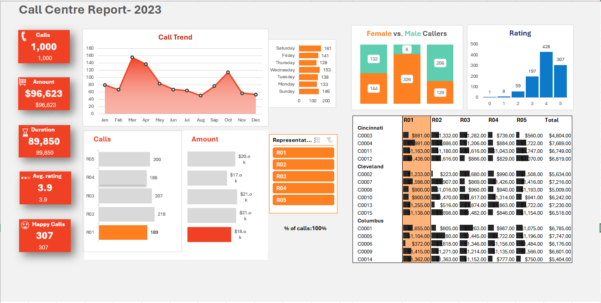

# Call Centre Dashboard (Excel)

## Project Overview

An interactive Excel dashboard built to analyze call centre performance and customer service metrics.

## Dashboard Preview

## Features

- Interactive dashboard
- Pivot Tables
- Pivot Charts
- KPI Tracking
- Customer Satisfaction Analysis
- Call Volume Analysis
- Representative Performance Analysis
- Slicers and Filters

## Tools Used

- Microsoft Excel
- Pivot Tables
- Pivot Charts
- Conditional Formatting
- Dashboard Design

## Dataset

The dataset contains call centre records including:

- Customer details
- Representative details
- Call duration
- Satisfaction ratings
- Purchase amounts
- Call dates

## Learning Outcome

Through this project I learned:

- Data analysis in Excel
- Dashboard creation
- KPI reporting
- Interactive visualizations
- Business reporting techniques

## Acknowledgement

This project was created for learning purposes using concepts from Chandoo's Excel Data Analysis series.
